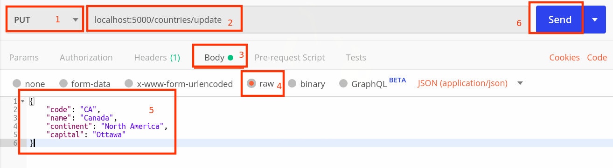

## Rest Method types demo

1.  Create new Maven project

    ```yaml
    Projectname:    restdemo2
    GroupId:        com.cg
    Packaging:      jar
    ```

2.  Modify `pom.xml` add parent depenendency and spring boot web starter dependency:

    ```xml
    <properties>
		<maven.compiler.target>1.8</maven.compiler.target>
		<maven.compiler.source>1.8</maven.compiler.source>
	</properties>

	<parent>
		<groupId>org.springframework.boot</groupId>
		<artifactId>spring-boot-parent</artifactId>
		<version>2.1.4.RELEASE</version>

	</parent>
	<dependencies>

		<dependency>
			<groupId>org.springframework.boot</groupId>
			<artifactId>spring-boot-starter-web</artifactId>
		</dependency>
	</dependencies>
    ```

3.  Create `com.cg.Application.java` as startup class

    ```java
    @SpringBootApplication
    public class Application {

        public static void main(String[] args) {
            SpringApplication.run(Application.class, args);
        }

    }
    ```

4.  Create `application.properties` inside `src/main/resources` directory.

    ```ini
    server.port=5000
    ```

5.  Create an Entity class `com.cg.entities.Country`

    ```java
    public class Country {
        private String code;
        private String name;
        private String continent;
        private String capital;
    //..getter,setters & two constructors...       
    }
    ```

6.  Create a DAO interface `com.cg.daos.CountryDAO`

    ```java
    import com.cg.entities.Country;

    public interface CountryDAO {
        void save(Country country);
        Country findByCode(String code);
        List<Country> findByContinent(String continent);
        void update(Country country);
    }

    ```

7.  Create DAO Implementation for CountryDAO `com.cg.daos.CountryDAOImpl`

    ```java
    @Repository
    public class CountryDAOImpl implements CountryDAO {

        List<Country> countries = new LinkedList<Country>();
        
        
        @PostConstruct
        public void populateSample() {
            countries.add(new Country("IN", "India", "Asia", "New Delhi"));
            countries.add(new Country("SK","Sri Lanka","Asia","Colambo"));
            countries.add(new Country("USA","United States of America","North America","Washington DC"));
        }
        
        public void save(Country country) {
            countries.add(country);
        }
        
        public Country findByCode(String code) {
            Country cn = null;
            Optional<Country> opt = countries.stream()
                                    .filter( c -> c.getCode().equalsIgnoreCase(code))
                                    .findFirst();
            if(opt.isPresent()) {
                cn = opt.get();
            }
            return cn;
        }

        public List<Country> findByContinent(String continent) {
            List<Country> list= 
                        countries.stream()
                        .filter( c -> c.getContinent().equalsIgnoreCase(continent))
                        .collect(Collectors.toList());
            return list;
        }

        public void update(Country country) {
            Country temp = findByCode(country.getCode());
            if(temp != null) {
                temp.setCapital(country.getCapital());
                temp.setContinent(country.getContinent());
            }
        }
    }
    ```
8.  Create a service class `com.cg.services.CountryService`

    ```java
    @Service
    public class CountryService {

        @Autowired private CountryDAO dao;
        
        public List<Country> byContinent(String continent){
            return dao.findByContinent(continent);
        }
        
        public Country byCode(String code) {
            return dao.findByCode(code);
        }
        
        public void create(Country country) {
            Country temp = dao.findByCode(country.getCode());
            if(temp==null)
            {
                dao.save(country);
            }else
                System.out.println("Country already exists!");
        }
        
        public void update(Country country) {
            Country temp = dao.findByCode(country.getCode());
            if(temp!=null)
            {
                dao.update(country);
            }else
                System.out.println("Country does not exists!");
        }
    }
    ```

9.  Create a rest controller `com.cg.controllers.CountryController`

    ```java
    @RestController
    @RequestMapping("/countries")
    public class CountryController {

        @Autowired CountryService service;
        
        @GetMapping(value="/code/{code}")	
        public Country findbycode(@PathVariable String code) {
            return service.byCode(code);
        }
        
        @GetMapping(value="/continent-{continent}")
        public List<Country> findbycontinent(@PathVariable String continent){
            return service.byContinent(continent);
        }
        
        @PostMapping(value="/new",consumes= {"application/json"})
        public String save(@RequestBody Country country) {
            service.create(country);
            return "country added!";
        }
        
        @PutMapping(value="/update",consumes= {"application/json"})
        public String update(@RequestBody Country country) {
            service.update(country);
            return "country updated";
        }        
    }
    ```

10. Run application and test using Postman.
    follow the steps in given screenshot:
    

11. Try hitting following URL to view the results:

    http://localhost:5000/countries/continent-north america

    or
    
    http://localhost:5000/countries/code/CA

12. Try updating capital city of canada using Postman :

    

    Now, Test following URL again:

    http://localhost:5000/countries/code/CA
